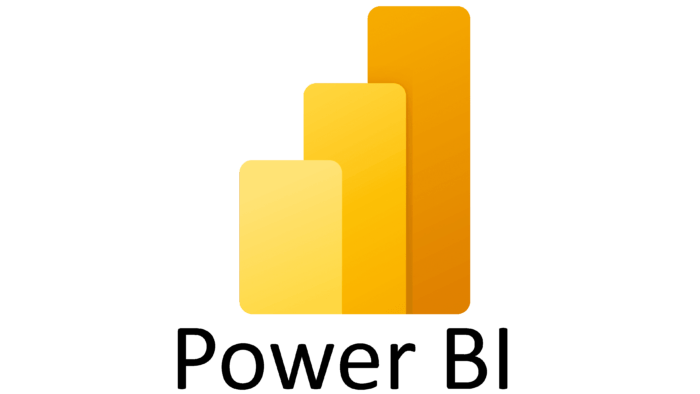

---
## 💫 About Me:
 Formado em Análise e Desenvolvimento de Sistemas, com um foco no desenvolvimento robusto e eficiente. Minha jornada acadêmica foi impulsionada pela compreensão dos fundamentos da lógica de programação e algoritmos. Ao longo do tempo, desenvolvi uma sólida compreensão das linguagens e frameworks essenciais para construir sistemas escaláveis e de alto desempenho.

   

---
<h2 align="center">🛠️ Technologies and Tools 🛠️</h2>

  <table align="center">
    <tr>
      <td align="center" width="96">
        
         Python
      </td>
      <td align="center" width="96">
        
         Java
      </td>
      <td align="center" width="96">
          
         JavaScript
      </td>
      <td align="center" width="96">
          
         TypeScript
      </td>
      <td align="center" width="96">
          
         HTML
      </td>
      <td align="center" width="96">
          
         CSS
      </td>
      <td align="center" width="96">
          
         MySQL
      </td>
    </tr>
    <tr>
      <td align="center" width="96">
          
         MongoDB
      </td>
      <td align="center" width="96">
          
         React
      </td>
      <td align="center" width="96">
          
         Spring Boot
      <td align="center" width="96">
          
         NODE.JS
      </td>
      <td align="center"  width="96">
          
         Tailwind
      </td>
      <td align="center" width="96">
          
         Bootstrap
      </td>
      <td align="center" width="96"> 
          
         Git
      </td>
    </tr>
    <tr>
    <td align="center"  width="96">
          
         GitHub
      </td>
    <td align="center"  width="96">
          
         Figma
      </td>
      <td align="center" width="96">
          
         Trello
      </td>
      <td align="center" width="96">
          
         Eclipse
      </td>
      <td align="center" width="96">
          
         VsCode
      </td>
      <td align="center" width="96">
          
         Spring Tool Suite
        </td>
        </td>
      <td align="center" width="96">
          
         PowerBI
      </td>
  </tr>
  </table>

  

## OUTROS:

- [x] INGLÊS TÉCNICO PARA LEITURA DE DOCUMENTAÇÕES.        
- [x] METODOLOGIA ÁGIL COM SCRUM.
- [x] MONTAGEM E MANUTENÇÃO DE MICROS.
- [x] REDE DOMÉSTICA.
- [X] CONHECIMENTO EM ENGENHARIA DE REQUISITOS.
- [X] MODELAGEM DE SOFTWARE (MOCKUP COM MARVEL E FIGMA).

 
 

      

